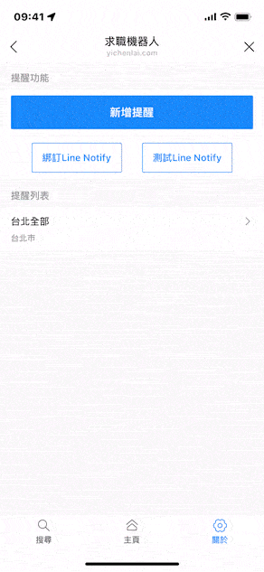
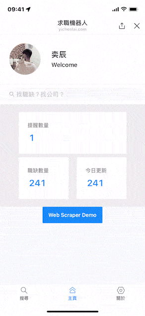
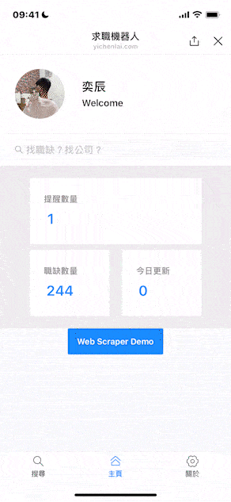

這個專案是在大學畢業專題製作時發想而成

### 專案初衷：

> 當職缺網站出現使用者想要的職缺便以Line提醒
> 職缺網站包括104及1111

#### 以Line作為使用者介面

首先會需要打造一個網站供使用者操作，再透過Line Liff把網站包裝到自己的Line官方帳號。

再來因為用官方帳號直接發送訊息給使用者若一定時間超過限制會收取費用，所以也用綁定Line Notify來達到免費通知使用者。

### 專案流程： 

從...角度思考

系統：
1. 系統定期爬蟲網站
2. 比對有無符合使用者條件的新職缺
3. 發送通知給使用者

針對行動裝置透過Line進行職缺推播提醒，以Line作為介面讓使用者操作

使用者：
1. 透過官方帳號的Line Liff設定條件
2. 綁定Line Notify
3. 收到Line Notify通知

-----

1. 透過Line Liff登入

2. 提醒的新增、移除

3. Line Notify的綁定及測試

4. 爬蟲後提醒的Demo

#### 當時的問題點

1. 搜集資料

每天爬全站的清單，因為網站有頁數上限，所以要很精確的條件來爬。

歷時很久且容易有反爬蟲。

> 反思：其實應該由使用者的條件進行搜尋，方向可以改成追蹤公司有無開新職缺

2. 設定條件

104跟1111的條件大不相同，故需要做資料清洗

> 反思：應該縮限到不必做資料清洗，從可行性開始計畫

  
#### 反思

當時很專注於把104人力銀行完整的爬下來，其中遇到了一些問題，

首先104的搜尋api只提供上限250頁，如果要完整的取得所有職缺，需要限縮條件來搜尋

但是其實每次的提醒都用全站爬蟲來比對很不經濟，只有離峰時間才不會被擋下

應該讓使用者把條件限縮精細一些，再用條件來進行定期爬蟲，再來找出新職缺來推播

## 後記專案：
[Github Repo](https://github.com/yichenlai16/104-job-scraper)

### 專案目的：

因為爬蟲這部分比較單純，所以就把他拉出來作為一個專案，順便練習了把專案容器化。

104搜尋API限制在這個專案裡沒有繞過限制，如果有需要的話需要自行修改。

###  專案技術
- Docker 容器化
- Scrapy 爬蟲
- Elasticsearch 資料庫
> Elasticsearch有透過Docker包裝，會有IK Analysis Plugin 中文分詞器，再來進行OpenCC翻譯成繁體中文`
